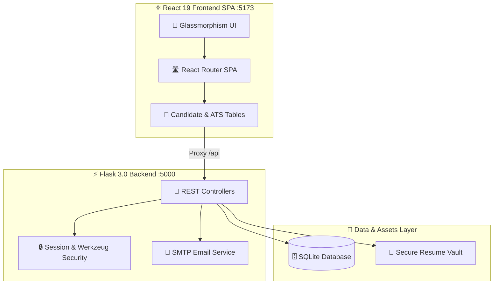
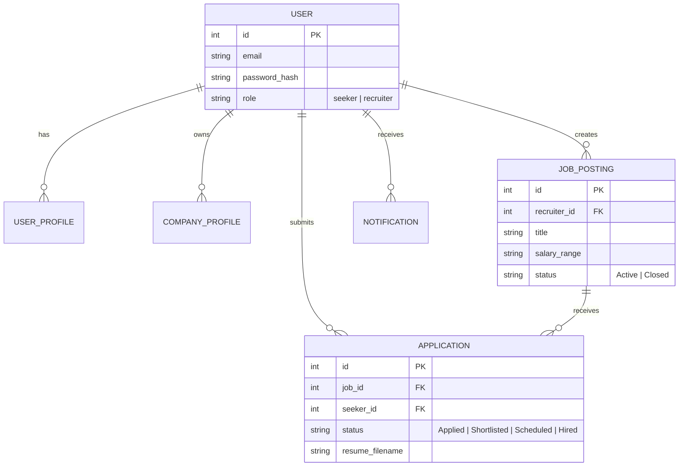

  

  

  
  
  
  
  
  

---

  

> [!IMPORTANT]
> **Job Sphere Studio** is an enterprise-ready, full-stack recruitment platform and automated Applicant Tracking System (ATS). It bridges top tech talent with innovative employers through automated screening pipelines, real-time candidate metrics, and instant email interview dispatching.

  

---

  

  <table>
    <tr>
      <td width="50%" align="center">
        <b>🏠 Candidate Portal & Discovery Feed</b>  
        
      </td>
      <td width="50%" align="center">
        <b>🔐 Dual-Role Authentication & Access Control</b>  
        
      </td>
    </tr>
  </table>

  

---

  

  

---

  

  

---

  

---

  

  

---

  

  

---

  <h3>✨ Job Sphere Studio — Engineering Tomorrow's Hiring Infrastructure ✨</h3>

