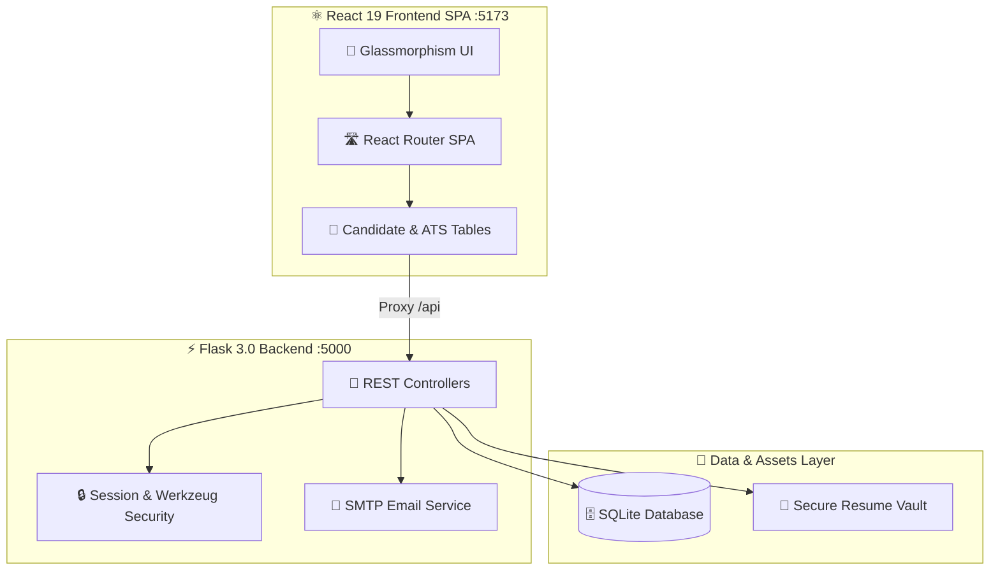
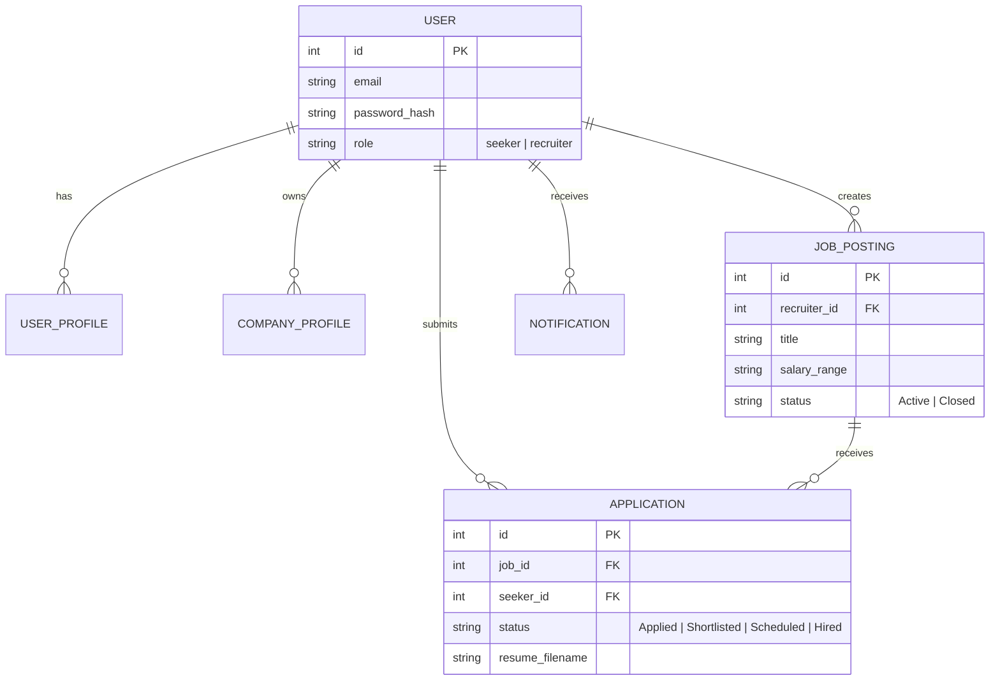

<p align="center">
  
</p>

<p align="center">
  <a href="https://github.com/Nivedreddy6/Flask"></a>
</p>

<p align="center">
  <a href="https://flask.palletsprojects.com/"></a>
  <a href="https://react.dev/"></a>
  <a href="https://vite.dev/"></a>
  <a href="https://www.sqlite.org/"></a>
  <a href="https://oxc.rs/"></a>
  <a href="#"></a>
</p>

---

<p align="center">
  
</p>

> [!IMPORTANT]
> **Job Sphere Studio** is an enterprise-ready, full-stack recruitment platform and automated Applicant Tracking System (ATS). It bridges top tech talent with innovative employers through automated screening pipelines, real-time candidate metrics, and instant email interview dispatching.

<table>
  <tr>
    <td width="33%" align="center" bgcolor="#0f172a">
      <h3 style="color:#818cf8;">🎯 Job Discovery</h3>
      <p style="color:#cbd5e1;">Instant role matching, compensation filters, and 1-click resume uploads.</p>
    </td>
    <td width="33%" align="center" bgcolor="#1e1b4b">
      <h3 style="color:#c084fc;">⚡ Recruiter ATS</h3>
      <p style="color:#cbd5e1;">Multi-stage candidate pipelines, status tracking, and notes management.</p>
    </td>
    <td width="33%" align="center" bgcolor="#083344">
      <h3 style="color:#22d3ee;">📧 Interview Mailer</h3>
      <p style="color:#cbd5e1;">Automated branded HTML invitation dispatch with meeting links.</p>
    </td>
  </tr>
</table>

---

<p align="center">
  
</p>

<div align="center">
  <table>
    <tr>
      <td width="50%" align="center">
        <b>🏠 Candidate Portal & Discovery Feed</b><br/><br/>
        
      </td>
      <td width="50%" align="center">
        <b>🔐 Dual-Role Authentication & Access Control</b><br/><br/>
        
      </td>
    </tr>
  </table>
</div>

> [!TIP]
> **Comprehensive Feature Highlights:**
> * 📈 **Interactive Hiring Funnel**: Real-time conversion heatmaps (Applied ➔ Reviewing ➔ Shortlisted ➔ Interview Scheduled ➔ Hired).
> * 📑 **Resume Management**: Automated file-type verification (PDF, DOCX, TXT) and secure authenticated streaming.
> * 🔔 **Live In-App Notification Center**: Instant triggers on application reviews, interview invitations, and status shifts.

---

<p align="center">
  
</p>

<table>
  <thead>
    <tr bgcolor="#1e1b4b">
      <th width="50%" style="color:#c7d2fe;"><h3>🏢 Recruiter ATS Operations</h3></th>
      <th width="50%" style="color:#67e8f9;"><h3>🎯 Candidate Career Journey</h3></th>
    </tr>
  </thead>
  <tbody>
    <tr>
      <td valign="top">
        <ol>
          <li><b>Post Opportunities</b>: Create listings with department tags, salary ranges (<code>$120k - $160k</code>), and experience requirements.</li>
          <li><b>Review Pipeline</b>: Inspect candidate resumes, portfolio links, and transition applicants across hiring stages.</li>
          <li><b>Schedule Interviews</b>: Trigger calendar invites, date/time pickers, and video meeting URLs with one click.</li>
          <li><b>Analyze Metrics</b>: Monitor active posts, applicant counts, and shortlist velocity.</li>
        </ol>
      </td>
      <td valign="top">
        <ol>
          <li><b>Explore Openings</b>: Search roles by title, category, salary tier, and remote/on-site status.</li>
          <li><b>1-Click Apply</b>: Upload resumes and submit applications seamlessly.</li>
          <li><b>Live Tracker</b>: Track hiring progress through a dynamic multi-stage visual stepper.</li>
          <li><b>Learn & Upskill</b>: Access curated engineering career resources and tech community networks.</li>
        </ol>
      </td>
    </tr>
  </tbody>
</table>

---

<p align="center">
  
</p>

<p align="center">
  
</p>

> [!NOTE]
> **Decoupled Architecture**: The React 19 SPA (`port 5173`) communicates with the Flask REST Backend (`port 5000`) via Vite's automated reverse proxy, allowing independent scaling and seamless development workflows.



---

<p align="center">
  
</p>



---

<p align="center">
  
</p>

| HTTP Method | Route Endpoint | Purpose | Authorization |
| :--- | :--- | :--- | :---: |
| `POST` | `/api/auth/login` | Session login & cookie issue | Public |
| `POST` | `/api/auth/register` | User / Recruiter registration | Public |
| `GET` | `/api/auth/me` | Current authenticated session info | **User Session** |
| `GET` | `/api/jobs` | Retrieve filtered job postings list | Public |
| `POST` | `/api/jobs` | Post new vacancy | **Recruiter** |
| `GET` | `/api/applications` | Fetch candidate applications pipeline | **Authenticated** |
| `POST` | `/api/applications/<id>/status` | Update applicant hiring stage | **Recruiter** |
| `POST` | `/api/applications/<id>/interview` | Dispatch interview invite email | **Recruiter** |
| `GET` | `/uploads/resumes/<filename>` | Authenticated resume streaming | **Authenticated** |

---

<p align="center">
  
</p>

### 1️⃣ Launch Flask Backend (`Port 5000`)
```powershell
# Activate Python Virtual Environment
.\Scripts\Activate.ps1

# Run Flask backend server
python backend/app.py
```
> 🌐 Backend URL: **http://127.0.0.1:5000**

### 2️⃣ Launch React 19 Frontend (`Port 5173`)
```powershell
# Open a new terminal tab and enter frontend
cd frontend

# Install packages & start Vite HMR
npm install
npm run dev
```
> 🌐 Frontend URL: **http://localhost:5173**

---

<div align="center">
  <h3>✨ Job Sphere Studio — Engineering Tomorrow's Hiring Infrastructure ✨</h3>
</div>
