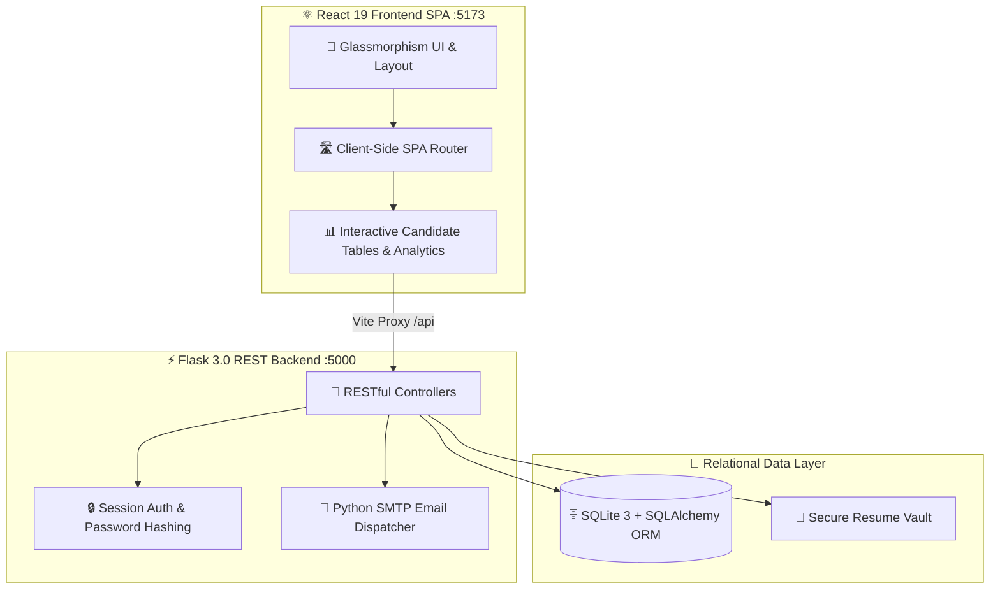
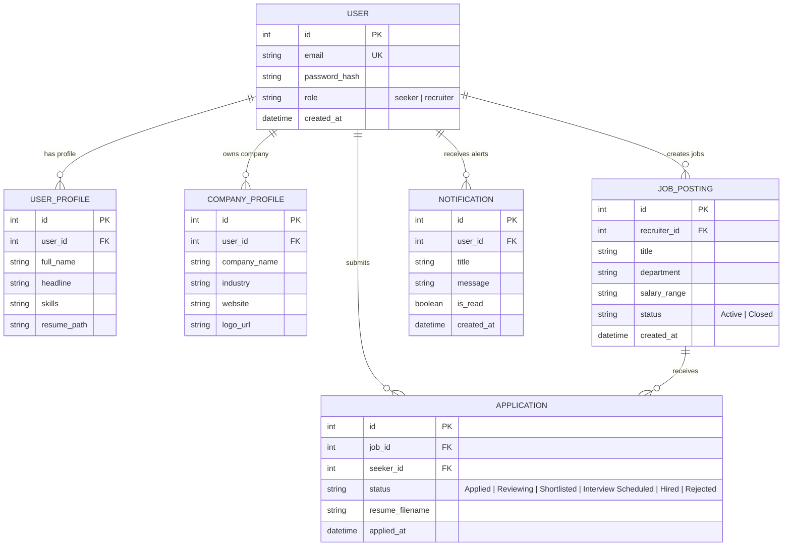

<p align="center">
  
</p>

<p align="center">
  
</p>

<p align="center">
  
  
  
  
  
  
</p>

---

<p align="center">
  
</p>

## 💡 What is Job Sphere Studio? (The Big Picture)

Traditional hiring is fragmented. Job seekers apply into black holes with no status feedback, while tech recruiters get buried in scattered emails, spreadsheets, and manual interview scheduling.

**Job Sphere Studio** is a complete, full-stack recruitment ecosystem designed to fix this. It seamlessly connects **Job Seekers** and **Recruiters** into a single, automated hiring machine:

1. **For Job Seekers**: A streamlined career portal where candidates search curated tech jobs with transparent salary ranges, apply with 1-click resume uploads, and track their applications live through every stage.
2. **For Recruiters**: A high-velocity **Applicant Tracking System (ATS)** where hiring managers can post vacancies, review resumes, advance candidates across stages, and schedule interviews with automated calendar-ready email invitations.
3. **For Engineering Teams**: A modern, decoupled hybrid architecture combining a high-performance **Flask REST Backend** (Python) with a reactive, glassmorphic **React 19 + Vite Frontend**.

<p align="center">
  
</p>

---

<p align="center">
  
</p>

## 🔄 End-to-End Website Walkthrough (How It Works)

Here is the exact step-by-step user journey from account creation to getting hired:

<p align="center">
  
</p>

<p align="center">
  
</p>

---

<p align="center">
  
</p>

## 🧭 Page-by-Page Feature Tour

<div align="center">
  <table>
    <tr>
      <td width="50%" align="center">
        <b>🏠 Candidate Portal & Discovery Feed</b><br/><br/>
        
      </td>
      <td width="50%" align="center">
        <b>🔐 Dual-Role Authentication & Access Control</b><br/><br/>
        
      </td>
    </tr>
  </table>
</div>

### 🎯 1. Job Seeker Experience (Candidate Side)
* **Job Discovery Feed (`/seeker/jobs`)**: Instant multi-criteria search filtering by job title, department (Frontend, Backend, AI/ML, DevOps), employment type (Full-time, Remote, Hybrid), and salary tier.
* **1-Click Application (`/seeker/job/<id>`)**: Candidates can upload PDF/DOCX resumes and submit applications instantly.
* **Candidate Dashboard (`/seeker/dashboard`)**: Visual application tracker showing color-coded status badges: `Applied` ➔ `Reviewing` ➔ `Shortlisted` ➔ `Interview Scheduled` ➔ `Hired`.
* **Notifications Center (`/notifications`)**: Real-time alerts whenever a recruiter reviews an application, updates a stage, or schedules an interview.
* **Upskilling & Learning Hub (`/learning`)**: Integrated library of curated engineering tutorials, interview prep cheat-sheets, and system design roadmaps.
* **Tech Community Directory (`/people`)**: Peer networking portal to connect with fellow engineers and industry professionals.

### 🏢 2. Recruiter & ATS Command Suite (Employer Side)
* **Recruiter Command Dashboard (`/recruiter/dashboard`)**: Live recruitment KPIs showing active job count, applicant volume, shortlisted talent, and upcoming interviews.
* **Job Posting Wizard (`/recruiter/post_job`)**: Intuitive form to broadcast new job vacancies with custom salary ranges, required skill tags, and location preferences.
* **Candidate ATS Table (`/recruiter/applications`)**: Centralized applicant management table. Recruiters can view applicant bios, download submitted resumes securely, and advance candidate stages with a single click.
* **Automated Interview Scheduler (`/recruiter/schedule_interview`)**: Select candidate, pick date & time, add Google Meet / Zoom link, and write custom prep notes.
* **Automated SMTP Email Dispatcher**: When an interview is scheduled, the platform renders and delivers a branded HTML interview invitation directly to the candidate's inbox.
* **Company Profile Management (`/recruiter/company_profile`)**: Showcase company branding, logo, tech stack, culture, and active vacancies.

<p align="center">
  
</p>

---

<p align="center">
  
</p>

## 🏛 Technical Architecture & Technology Stack

The platform is designed with a **decoupled hybrid architecture** for optimal performance, responsiveness, and developer experience:

<p align="center">
  
</p>



### 🛠️ Core Technologies Used:
* **Frontend**: **React 19**, **Vite 8**, **Lucide React** icons, custom cyber-glassmorphism CSS design system, and **Oxlint** (Rust-based sub-millisecond linter).
* **Backend**: **Python 3.12**, **Flask 3.0**, **Flask-SQLAlchemy** (ORM), **Werkzeug** (security & password hashing), and **Flask-CORS**.
* **Database**: **SQLite 3** relational database with automated seeding and foreign-key constraints.
* **Email Engine**: Python **`smtplib`** and **`email.mime`** for automated, responsive HTML email delivery.

---

<p align="center">
  
</p>

## 📊 Relational Database Schema

The database model is built with SQLAlchemy with clean relational entities:



---

<p align="center">
  
</p>

## 🔌 RESTful API Endpoints Specification

<p align="center">
  
</p>

---

<p align="center">
  
</p>

## ⚡ How to Run Locally

<p align="center">
  
</p>

### 1️⃣ Launch Backend Server (Flask)
```powershell
# Activate Python Virtual Environment
.\Scripts\Activate.ps1

# Start Flask Backend Server on Port 5000
python backend/app.py
```
> 🌐 **Backend URL**: [http://127.0.0.1:5000](http://127.0.0.1:5000)

### 2️⃣ Launch Frontend Server (React 19 + Vite)
```powershell
# In a new terminal window:
cd frontend

# Install dependencies (first time only)
npm install

# Start Vite Development Server on Port 5173
npm run dev
```
> 🌐 **Frontend URL**: [http://localhost:5173](http://localhost:5173) *(automatically proxies `/api` calls to port 5000)*

---

<div align="center">
  <h3>✨ Job Sphere Studio — Engineering Tomorrow's Hiring Infrastructure ✨</h3>
  <p>Built with precision, automated workflows, and a modern developer experience.</p>
</div>
