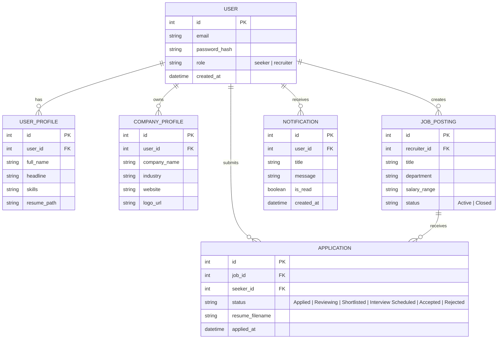

<p align="center">
  
</p>

<p align="center">
  <a href="https://flask.palletsprojects.com/"></a>
  <a href="https://react.dev/"></a>
  <a href="https://vite.dev/"></a>
  <a href="https://www.sqlite.org/"></a>
  <a href="https://oxc.rs/"></a>
  <a href="#"></a>
</p>

---

<div align="center">

# 🌐 Job Sphere Studio — Full-Stack Recruitment & Career Ecosystem

### 🚀 *Bridging High-Caliber Tech Talent with Visionary Companies through Automated Pipelines and Fluid Glassmorphic Design.*

[📖 Project Overview](#-project-overview) • [✨ Core Modules & Capabilities](#-core-modules--capabilities) • [👥 User Journeys](#-user-journeys--personas) • [🏛 Architecture](#-system-architecture) • [📊 Data Model](#-database-schema--models) • [🔌 API Reference](#-rest-api-reference) • [⚡ Quickstart](#-step-by-step-setup--installation)

</div>

---

## 📖 Project Overview

**Job Sphere Studio** is an enterprise-grade, full-stack recruitment portal and Applicant Tracking System (ATS). It connects **Job Seekers** and **Recruiters** in a unified, automated hiring workflow:

* 🎯 **For Job Seekers**: An intuitive discovery engine allowing candidates to browse curated openings, filter by compensation and experience, submit 1-click applications with resume uploads, and track real-time hiring progress.
* 🏢 **For Recruiters**: A streamlined ATS dashboard offering multi-stage candidate management, status progression triggers, instant automated interview scheduling via email, and pipeline conversion analytics.
* ⚡ **Hybrid Architecture**: Combines a robust **Flask REST API & Session Engine** with a lightning-fast **React 19 + Vite SPA** client adorned in a bespoke dark glassmorphic design language.

---

## 🎨 Visual Showcase & UI Previews

<div align="center">
  <table>
    <tr>
      <td width="50%" align="center">
        <b>🏠 Job Discovery & Candidate Portal</b><br/><br/>
        
      </td>
      <td width="50%" align="center">
        <b>🔐 Secure Role-Based Authentication</b><br/><br/>
        
      </td>
    </tr>
  </table>
</div>

---

## ✨ Core Modules & Capabilities

```
┌─────────────────────────────────────────────────────────────────────────────────┐
│                           🌟 JOB SPHERE STUDIO PLATFORM                         │
├───────────────────────────────┬─────────────────────────────────────────────────┤
│  🏢 RECRUITER ATS SUITE       │  🎯 CANDIDATE JOB SUITE                         │
│  • Job Posting & Management   │  • Smart Search & Dynamic Filtering             │
│  • Candidate Pipeline Board   │  • 1-Click Multi-Format Resume Upload           │
│  • Interactive Interview Flow │  • Real-Time Stage Progress Bar                 │
│  • SMTP Email Notifications   │  • In-App Action Alerts & Notifications         │
│  • Visual Recruitment Funnel  │  • Integrated Learning Hub & Peer Network       │
└───────────────────────────────┴─────────────────────────────────────────────────┘
```

---

## 👥 User Journeys & Personas

<table>
  <thead>
    <tr style="background-color: #1e1b4b;">
      <th width="50%"><h3>🏢 Recruiter Persona</h3></th>
      <th width="50%"><h3>🎯 Candidate Persona</h3></th>
    </tr>
  </thead>
  <tbody>
    <tr>
      <td valign="top">
        <h4>1. Post & Broadcast Roles</h4>
        <p>Define job requirements, department tags, salary ranges (e.g. <code>$120k - $160k</code>), remote/on-site preferences, and experience criteria.</p>
        
        <h4>2. Candidate Screening & Pipeline</h4>
        <p>Review candidate profiles, download submitted resumes (PDF/DOCX), and advance candidates across stages:</p>
        <p><code>Applied</code> ➔ <code>Reviewing</code> ➔ <code>Shortlisted</code> ➔ <code>Interview Scheduled</code> ➔ <code>Accepted / Rejected</code></p>
        
        <h4>3. Automated Interview Dispatch</h4>
        <p>Schedule dates, times, and meeting links (Google Meet, Zoom, Teams) directly from the dashboard. Generates and sends branded HTML email invitations.</p>

        <h4>4. Hiring Intelligence & Metrics</h4>
        <p>Live metrics on active listings, total applicants, shortlist ratios, and hiring velocity.</p>
      </td>
      <td valign="top">
        <h4>1. Explore & Filter Opportunities</h4>
        <p>Filter thousands of positions by keyword, role type (Full-time, Contract, Remote), location, and competitive pay scales.</p>

        <h4>2. Streamlined Resume Application</h4>
        <p>Upload resumes with automated format verification and attach custom cover letters or portfolios.</p>

        <h4>3. Live Status Tracking</h4>
        <p>Stay informed with clear visual stage trackers showing exactly where your application stands in the review cycle.</p>

        <h4>4. Notifications & Upskilling</h4>
        <p>Receive real-time alerts when recruiters review your application, schedule interviews, or release updates, plus access curated career development courses.</p>
      </td>
    </tr>
  </tbody>
</table>

---

## 🏛 System Architecture

<p align="center">
  
</p>

### 🔧 Technological Foundation

| Layer | Technology | Key Responsibility |
| :--- | :--- | :--- |
| **Frontend Framework** | **React 19** + **Vite 8** | High-performance Single Page Application with instantaneous Hot Module Replacement (HMR). |
| **Design System** | **Vanilla CSS + Glassmorphism** | Dark aesthetic featuring backdrop blurs, luminous gradient borders, responsive layouts, and micro-interactions. |
| **Icons & Visuals** | **Lucide React** + **Custom SVGs** | Crisp vector iconography and animated graphic banners. |
| **Backend API Server** | **Flask 3.0 (Python)** | REST endpoints, session-based auth, secure file management, and CORS middleware. |
| **Database & ORM** | **SQLite 3** + **SQLAlchemy** | Relational data layer managing users, profiles, postings, applications, and logs. |
| **Email Service** | **Python `smtplib` / `email`** | Dynamic HTML interview template rendering and SMTP delivery. |
| **Code Quality** | **Oxlint (Rust-Powered)** | Sub-millisecond static code analysis and linting. |

---

## 📊 Database Schema & Models



---

## 🔌 REST API Reference

The backend exposes authenticated REST endpoints consumable by both the React SPA and third-party integrations:

| Method | Endpoint | Description | Auth Required |
| :--- | :--- | :--- | :---: |
| `POST` | `/api/auth/login` | Authenticates user and initiates secure session | No |
| `POST` | `/api/auth/register` | Registers a new candidate or recruiter account | No |
| `GET` | `/api/auth/me` | Retrieves profile and role of authenticated user | **Yes** |
| `GET` | `/api/jobs` | Fetches filtered active job postings list | No |
| `POST` | `/api/jobs` | Creates a new job posting (Recruiters only) | **Yes** (Recruiter) |
| `GET` | `/api/applications` | Fetches applicant pipeline / user's applications | **Yes** |
| `POST` | `/api/applications/<id>/status` | Updates stage (Shortlist, Schedule, Reject, etc.) | **Yes** (Recruiter) |
| `POST` | `/api/applications/<id>/interview` | Dispatches interview invitation email & updates status | **Yes** (Recruiter) |
| `GET` | `/uploads/resumes/<filename>` | Securely streams candidate resume files | **Yes** |

---

## ⚡ Step-by-Step Setup & Installation

### Prerequisites
* **Python 3.10+**
* **Node.js 18+** & **npm**

### 1️⃣ Clone the Repository
```bash
git clone https://github.com/Nivedreddy6/Flask.git
cd Flask
```

### 2️⃣ Configure & Start Backend
```powershell
# Activate Python Virtual Environment
.\Scripts\Activate.ps1

# Install backend dependencies (if needed)
pip install -r backend/requirements.txt

# Launch Flask Server on http://127.0.0.1:5000
python backend/app.py
```

### 3️⃣ Configure & Start React Frontend
```powershell
# Open a new terminal and navigate to frontend
cd frontend

# Install Node dependencies
npm install

# Start Vite Development Server on http://localhost:5173
npm run dev
```

---

## 🌐 Live Access URLs

| Application Component | URL | Default Port |
| :--- | :--- | :---: |
| ⚛️ **React 19 Modern SPA** | [http://localhost:5173](http://localhost:5173) | `5173` |
| ⚡ **Flask REST API & Web App** | [http://127.0.0.1:5000](http://127.0.0.1:5000) | `5000` |

---

## 🤝 Contributing & License

1. Fork the Project
2. Create your Feature Branch (`git checkout -b feature/AmazingFeature`)
3. Commit your Changes (`git commit -m 'feat: add amazing new capability'`)
4. Push to the Branch (`git push origin feature/AmazingFeature`)
5. Open a Pull Request

---

<p align="center">
  <b>Job Sphere Studio</b> • Built with modern engineering and designed to elevate careers.
</p>
