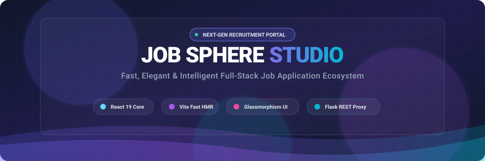
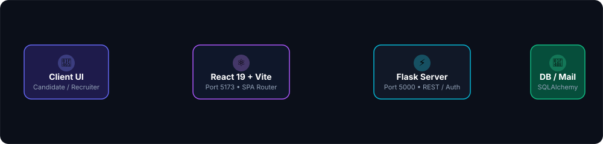
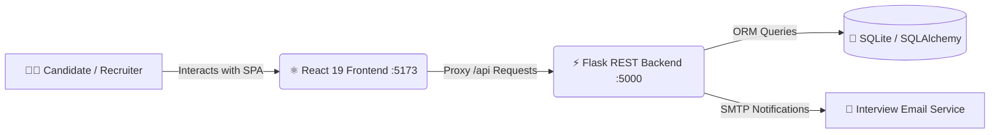

<p align="center">
  
</p>

<p align="center">
  <a href="https://react.dev/"></a>
  <a href="https://vite.dev/"></a>
  <a href="https://flask.palletsprojects.com/"></a>
  <a href="https://oxc.rs/"></a>
  <a href="https://lucide.dev/"></a>
  <a href="#"></a>
</p>

---

<div align="center">

### 🌟 **Welcome to Job Sphere Studio Frontend**
An ultra-modern, high-performance Applicant Tracking & Job Discovery UI engineered with **React 19**, **Vite 8**, and styled with **custom glassmorphism** aesthetic.

[🚀 Quick Start](#-quick-start) • [✨ Key Features](#-key-features) • [🏛 Architecture](#-system-architecture) • [📜 Scripts](#-available-scripts) • [⚙️ Configuration](#%EF%B8%8F-proxy--network-configuration)

</div>

---

## ✨ Key Features

<table>
  <tr>
    <td width="50%" valign="top">
      <h3>💼 Recruiter Power Dashboard</h3>
      <ul>
        <li>📊 <b>Real-time Metrics:</b> Track active jobs, pending reviews, shortlisted, and interview candidates.</li>
        <li>📑 <b>Applicant Tracking:</b> Fast multi-stage candidate management with one-click status transitions.</li>
        <li>📅 <b>Interview Scheduling:</b> Automated scheduling modal with instant calendar & email alerts.</li>
        <li>📈 <b>Interactive Analytics:</b> Visual status breakdowns, conversion rates, and hiring pipeline heatmaps.</li>
      </ul>
    </td>
    <td width="50%" valign="top">
      <h3>🚀 Candidate Job Portal</h3>
      <ul>
        <li>🔍 <b>Smart Discovery:</b> Search by role, salary brackets, experience level, and job category.</li>
        <li>⚡ <b>1-Click Application:</b> Upload resumes (PDF/DOCX) with instant status sync.</li>
        <li>📬 <b>Live Notifications:</b> Instant in-app feedback on recruiter actions and stage progressions.</li>
        <li>🎨 <b>Glassmorphic Experience:</b> Premium dark-mode UI with vibrant glows and fluid micro-animations.</li>
      </ul>
    </td>
  </tr>
</table>

---

## 🏛 System Architecture

<p align="center">
  
</p>



---

## 🚀 Quick Start

### 1️⃣ Clone & Install Dependencies
```bash
# Navigate to the frontend directory
cd frontend

# Install packages
npm install
```

### 2️⃣ Run Development Server
```bash
# Start Vite development server with instant HMR
npm run dev
```

Your web client will be live at:
👉 **[http://localhost:5173](http://localhost:5173)**

---

## 📜 Available Scripts

| Command | Description |
| :--- | :--- |
| `npm run dev` | Spawns the local Vite HMR server on port `5173` |
| `npm run build` | Compiles and optimizes assets into production `/dist` bundle |
| `npm run preview` | Runs a local web server to preview the production build |
| `npm run lint` | Blazing-fast linting powered by [Oxlint](https://oxc.rs) |

---

## ⚙️ Proxy & Network Configuration

The frontend communicates with the Flask backend running on port `5000` via Vite's automated reverse proxy defined in `vite.config.ts`:

```typescript
export default defineConfig({
  plugins: [react()],
  server: {
    port: 5173,
    proxy: {
      '/api': {
        target: 'http://127.0.0.1:5000',
        changeOrigin: true,
        secure: false,
      },
    },
  },
})
```

---

## 📂 Project Directory Structure

```text
frontend/
├── public/
│   ├── banner.svg           # Animated SVG Hero Header
│   └── workflow.svg         # Animated Architecture Pipeline
├── src/
│   ├── assets/              # Static media and brand graphics
│   ├── components/          # Reusable UI Blocks & Modals
│   │   ├── AnalyticsDashboard.jsx
│   │   ├── ApplicationsTable.jsx
│   │   ├── Navbar.jsx
│   │   └── TopBanner.jsx
│   ├── pages/               # Top-level view controllers
│   │   ├── ApplicationsPage.jsx
│   │   └── DashboardPage.jsx
│   ├── App.jsx              # Main App wrapper & routing
│   ├── index.css            # Design system, glassmorphism tokens & animations
│   └── main.jsx             # React 19 DOM bootstrap root
├── .oxlintrc.json           # Fast Oxlint configuration
├── package.json             # Frontend dependencies & scripts
└── vite.config.ts           # Vite server & reverse-proxy config
```

---

<p align="center">
  <b>Job Sphere Studio</b> • Engineered with ❤️ for high-velocity recruitment workflows.
</p>
