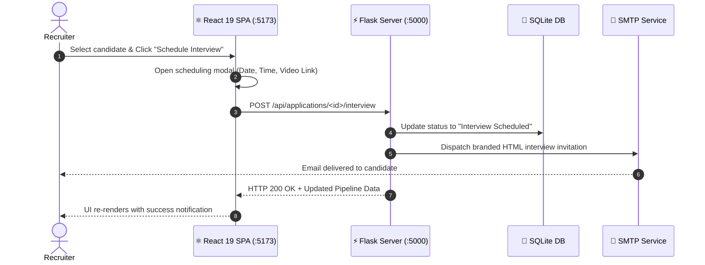

  

  

  
  
  
  
  
  

---

  

## 💡 What is the Job Sphere Studio Frontend?

The **Job Sphere Studio Frontend** is a high-performance Single Page Application (SPA) engineered with **React 19** and **Vite 8**. It serves as the primary modern user interface for both **Recruiters** and **Job Seekers**, communicating with the Flask backend API.

### 🌟 Key Responsibilities:
1. **Interactive Recruiter ATS Dashboard**: View applicant metrics, transition candidates between review stages in real-time, and trigger interview scheduling modals.
2. **Dynamic Candidate Discovery & Application**: Instant multi-facet job search with salary filters and 1-click resume uploads.
3. **Automated Interview Workflow**: Modal interface for setting meeting times and video links, triggering automated SMTP invitation emails through the backend.
4. **Tailored Cyber-Glassmorphism UI**: Custom CSS design system with luminous gradients, glowing borders, dark mode aesthetic, and fluid micro-animations.

  

---

  

## 👥 Dual User Experience

  

---

  

## 🏛 System Architecture & Interview Sequence

  

---

  

## ⚡ How to Run the Frontend Locally

  

---

  

  
  
  

  <b>Job Sphere Studio</b> • Developed with ❤️ by <a href="https://github.com/Nivedreddy6"><b>Nived Reddy (@Nivedreddy6)</b></a>

