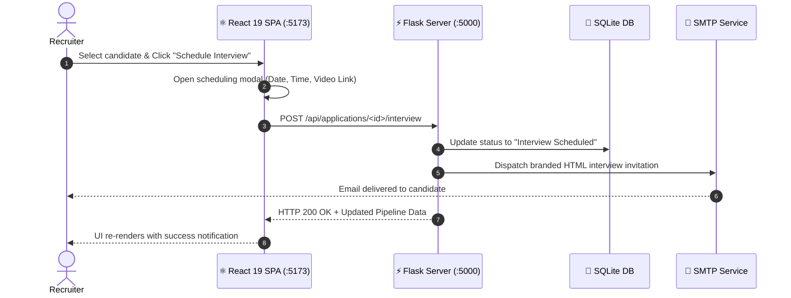

<p align="center">
  
</p>

<p align="center">
  <a href="https://react.dev/"></a>
  <a href="https://vite.dev/"></a>
  <a href="https://flask.palletsprojects.com/"></a>
  <a href="https://oxc.rs/"></a>
  <a href="https://lucide.dev/"></a>
  <a href="#"></a>
</p>

---

<div align="center">

# ⚛️ Job Sphere Studio — React 19 Frontend SPA

### 🌟 *An Ultra-Modern, Glassmorphic Recruitment UI Built with React 19, Vite 8, and Real-Time Backend Proxy.*

[📖 What is This Project?](#-what-is-this-project) • [✨ Core UI Capabilities](#-core-ui-capabilities) • [🏛 Architecture & Workflow](#-system-architecture--workflow) • [📂 Component Architecture](#-component-architecture) • [⚡ Quickstart](#-quick-start) • [📜 Scripts](#-available-scripts) • [⚙️ Proxy Config](#%EF%B8%8F-proxy--network-configuration)

</div>

---

## 📖 What is This Project?

The **Job Sphere Studio Frontend** is a Single Page Application (SPA) providing an interactive recruitment interface. It connects to the Flask API backend to deliver a recruitment experience with:

* 📊 **Recruiter Command Center**: Instant metric tracking for active jobs, candidate submissions, shortlist rates, and interview pipelines.
* 📋 **Interactive ATS Candidate Table**: Filterable and searchable applicant management table with instantaneous status updates and resume inspection.
* 📅 **Smart Interview Modal**: Integrated modal for setting interview dates, times, video conferencing links, and custom candidate notes with automated email triggers.
* 🎨 **Bespoke Glassmorphism Design**: Tailored CSS design system featuring backdrop blur filters, glowing gradient borders, responsive layouts, and fluid micro-animations.

---

## ✨ Core UI Capabilities

<table>
  <tr>
    <td width="50%" valign="top">
      <h3>💼 Recruiter Pipeline Suite</h3>
      <ul>
        <li>📊 <b>Real-time Metrics Dashboard:</b> Monitor active job counts, pending candidate reviews, shortlisted talent, and confirmed interviews.</li>
        <li>📑 <b>Applicant Tracking Board:</b> Fast multi-stage candidate management with one-click status transitions.</li>
        <li>📅 <b>Interview Scheduling:</b> Automated scheduling modal with instant calendar & email alerts.</li>
        <li>📈 <b>Interactive Analytics:</b> Visual status breakdowns, conversion rates, and hiring pipeline heatmaps.</li>
      </ul>
    </td>
    <td width="50%" valign="top">
      <h3>🚀 Candidate Experience Portal</h3>
      <ul>
        <li>🔍 <b>Smart Discovery:</b> Search and filter opportunities by title, compensation tier, and tech stack.</li>
        <li>⚡ <b>1-Click Application:</b> Submit resumes (PDF/DOCX) with immediate validation.</li>
        <li>📬 <b>Live Status Tracking:</b> Visual multi-step progress bar showing real-time application updates.</li>
        <li>🔔 <b>In-App Notifications:</b> Instant alerts when recruiters review, shortlist, or schedule interviews.</li>
      </ul>
    </td>
  </tr>
</table>

---

## 🏛 System Architecture & Workflow

<p align="center">
  
</p>



---

## 📂 Component Architecture

```text
frontend/src/
├── components/
│   ├── AnalyticsDashboard.jsx   # Top metric summary cards & KPIs
│   ├── ApplicationsTable.jsx    # Interactive ATS candidate management table
│   ├── Navbar.jsx               # Responsive header navigation & user avatar
│   └── TopBanner.jsx            # Announcement banner with quick actions
├── pages/
│   ├── ApplicationsPage.jsx     # Full-page applicant tracking view
│   └── DashboardPage.jsx        # Consolidated analytics and overview
├── App.jsx                      # Client router and layout wrapper
├── index.css                    # Glassmorphism tokens, gradients, animations
└── main.jsx                     # React 19 DOM mount root
```

---

## 🚀 Quick Start

### 1️⃣ Install Dependencies
```bash
cd frontend
npm install
```

### 2️⃣ Start Development Server
```bash
npm run dev
```

Your React client will be available at:
👉 **[http://localhost:5173](http://localhost:5173)**

---

## 📜 Available Scripts

| Command | Description |
| :--- | :--- |
| `npm run dev` | Spawns the local Vite HMR server on port `5173` |
| `npm run build` | Compiles and optimizes assets into production `/dist` bundle |
| `npm run preview` | Runs a local web server to preview the production build |
| `npm run lint` | Blazing-fast linting powered by [Oxlint](https://oxc.rs) |

---

## ⚙️ Proxy & Network Configuration

The frontend communicates with the Flask backend running on port `5000` via Vite's automated reverse proxy configured in `vite.config.ts`:

```typescript
export default defineConfig({
  plugins: [react()],
  server: {
    port: 5173,
    proxy: {
      '/api': {
        target: 'http://127.0.0.1:5000',
        changeOrigin: true,
        secure: false,
      },
    },
  },
})
```

---

<p align="center">
  <b>Job Sphere Studio</b> • Built with modern engineering and designed to elevate careers.
</p>
