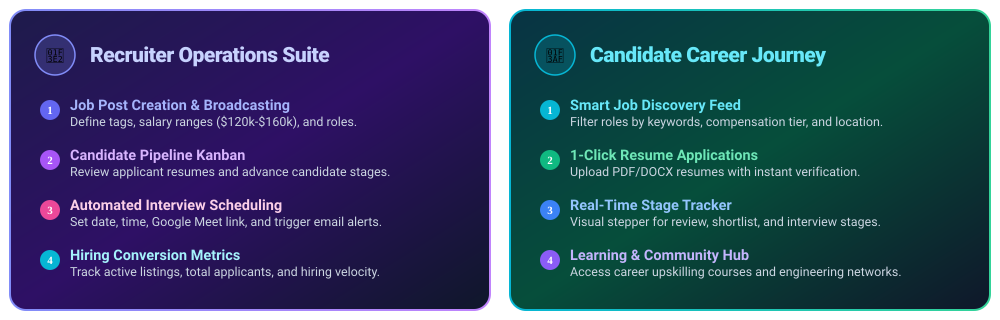
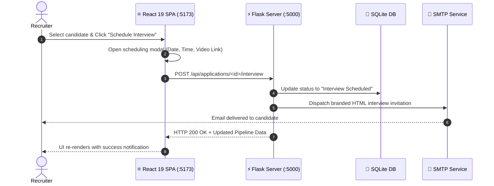

<p align="center">
  
</p>

<p align="center">
  
  
  
  
  
  
</p>

---

<p align="center">
  
</p>

> [!IMPORTANT]
> The **Job Sphere Studio Frontend** is an ultra-modern Single Page Application (SPA) designed to deliver a high-velocity recruitment experience with instant applicant status transitions, dynamic filtering, interactive interview modals, and real-time backend sync.

<p align="center">
  
</p>

---

<p align="center">
  
</p>

<p align="center">
  
</p>

---

<p align="center">
  
</p>

<p align="center">
  
</p>



---

<p align="center">
  
</p>

### 1️⃣ Install Dependencies
```bash
cd frontend
npm install
```

### 2️⃣ Run Development Server
```bash
npm run dev
```

> 🌐 Frontend SPA: **http://localhost:5173** (Proxies `/api` to `http://127.0.0.1:5000`)

---

<p align="center">
  <b>Job Sphere Studio</b> • Built with modern engineering and designed to elevate careers.
</p>
