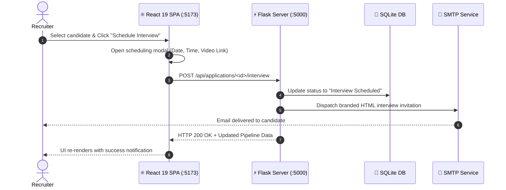

<p align="center">
  
</p>

<p align="center">
  <a href="https://react.dev/"></a>
  <a href="https://vite.dev/"></a>
  <a href="https://flask.palletsprojects.com/"></a>
  <a href="https://oxc.rs/"></a>
  <a href="https://lucide.dev/"></a>
  <a href="#"></a>
</p>

---

<p align="center">
  
</p>

> [!IMPORTANT]
> The **Job Sphere Studio Frontend** is an ultra-modern Single Page Application (SPA) designed to deliver a high-velocity recruitment experience with instant applicant status transitions, dynamic filtering, interactive interview modals, and real-time backend sync.

<table>
  <tr>
    <td width="50%" bgcolor="#0f172a">
      <h3 style="color:#818cf8;">💼 Recruiter Command Center</h3>
      <ul style="color:#cbd5e1;">
        <li>📊 <b>Real-time Metrics Dashboard</b>: Active job counts, review queues, shortlist rates.</li>
        <li>📑 <b>ATS Candidate Board</b>: Multi-stage applicant management with 1-click status transitions.</li>
        <li>📅 <b>Automated Interview Scheduling</b>: Meeting links and date/time selector with email triggers.</li>
      </ul>
    </td>
    <td width="50%" bgcolor="#1e1b4b">
      <h3 style="color:#c084fc;">🚀 Candidate Career Experience</h3>
      <ul style="color:#cbd5e1;">
        <li>🔍 <b>Smart Discovery</b>: Filter opportunities by title, salary bracket, and tech stack.</li>
        <li>⚡ <b>1-Click Apply</b>: Upload resumes with instant file validation.</li>
        <li>📬 <b>Live Status Stepper</b>: Visual multi-step progress tracking.</li>
      </ul>
    </td>
  </tr>
</table>

---

<p align="center">
  
</p>

<p align="center">
  
</p>



---

<p align="center">
  
</p>

### 1️⃣ Install Dependencies
```bash
cd frontend
npm install
```

### 2️⃣ Run Development Server
```bash
npm run dev
```

> 🌐 Frontend SPA: **http://localhost:5173** (Proxies `/api` to `http://127.0.0.1:5000`)

---

<p align="center">
  <b>Job Sphere Studio</b> • Built with modern engineering and designed to elevate careers.
</p>
